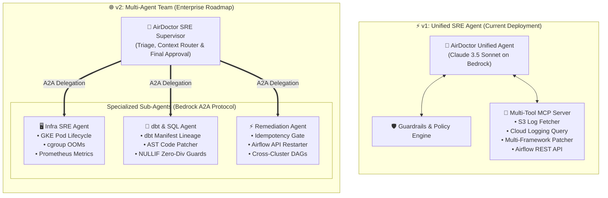
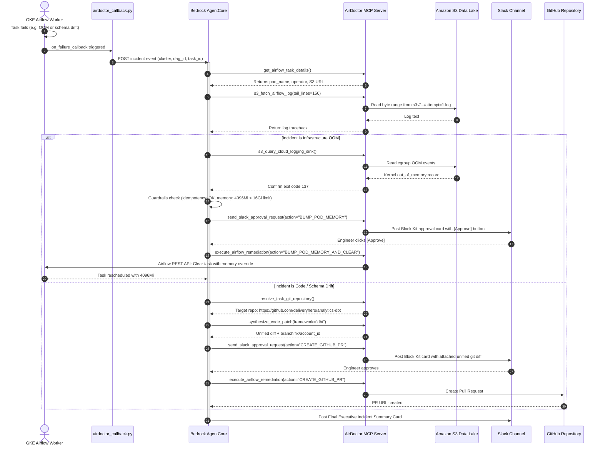

# 🏛️ AirDoctor: Architecture & Agent Topology

This document details the architectural design of **AirDoctor**, comparing the **v1 Unified SRE Agent** (current deployment) with the **v2 Multi-Agent Supervisor Roadmap**.

---

## 1. Single Agent (v1 MVP) vs. Multi-Agent Team (v2 Enterprise)



---

## 2. Complete End-to-End System Architecture (v1)

```
┌────────────────────────────────────────────────────────────────────────────────────────────────────────┐
│                                  MULTI-CLUSTER GKE AIRFLOW CLUSTERS                                    │
│                                                                                                        │
│   ┌──────────────────────────────┐  ┌──────────────────────────────┐  ┌────────────────────────────┐   │
│   │   [gke-prod-us-central1]     │  │[gke-analytics-europe-west1]  │  │   [gke-data-asia-east1]    │   │
│   │   • analytics_daily_etl      │  │• finance_daily_marts         │  │   • apac_orders_rollup     │   │
│   │   • financial_ledger_sync    │  │• eu_raw_ingestion_hourly     │  │   • wechat_alipay_settle   │   │
│   │   • stripe_reconciliation    │  │• inventory_optimizer         │  │                            │   │
│   └──────────────┬───────────────┘  └──────────────┬───────────────┘  └─────────────┬──────────────┘   │
│                  │                                 │                                │                  │
│                  └─────────────────────────────────┼────────────────────────────────┘                  │
│                                                    │ on_failure_callback                               │
│                                                    ▼                                                   │
│                                 ┌────────────────────────────────────┐                                 │
│                                 │   airdoctor_callback.py (Plugin)   │                                 │
│                                 │  • Non-blocking daemon thread      │                                 │
│                                 │  • Captures cluster/pod/exception  │                                 │
│                                 └──────────────────┬─────────────────┘                                 │
└────────────────────────────────────────────────────┼───────────────────────────────────────────────────┘
                                                     │ HTTP POST Event (Lightweight Metadata)
                                                     ▼
┌────────────────────────────────────────────────────────────────────────────────────────────────────────┐
│                                    AWS AGENTCORE & BEDROCK COGNITIVE RUNTIME                           │
│                                                                                                        │
│  ┌──────────────────────────────────────────────────┐         ┌─────────────────────────────────────┐  │
│  │           Amazon Bedrock (Claude 3.5 Sonnet)     │◄───────►│    LangGraph ReAct Cognitive Loop   │  │
│  │           • SRE Data Platform Persona            │         │    • Plan ➔ Act ➔ Observe           │  │
│  │           • Multi-Cluster Root Cause Diagnosis   │         │    • MemorySaver state tracking     │  │
│  └──────────────────────────────────────────────────┘         └──────────────────┬──────────────────┘  │
│                                                                                  │                     │
│  ┌───────────────────────────────────────────────────────────────────────────────┴──────────────────┐  │
│  │                            🛡️ ENTERPRISE SAFETY & IDEMPOTENCY GUARDRAILS                         │  │
│  │  • Failure Classifier (OOM vs Deadlock vs Schema Drift vs Rate Limit vs Data Quality)            │  │
│  │  • Idempotency Gate (Block retries on raw INSERT INTO; authorize for dbt / MERGE / OVERWRITE)   │  │
│  │  • Policy Limits (Max Memory Ceiling: 16GiB | Max Auto-Retries: 2 | Jitter Backoff: 10s-30s)    │  │
│  │  • Repo Resolver (Discovers target Git repo via Pod env, dbt manifest, DAG tags, and Catalog)   │  │
│  └───────────────────────────────────────────────┬──────────────────────────────────────────────────┘  │
└──────────────────────────────────────────────────┼─────────────────────────────────────────────────────┘
                                                   │ MCP Protocol (Streamable HTTP :8081)
                                                   ▼
┌────────────────────────────────────────────────────────────────────────────────────────────────────────┐
│                                       AIRDOCTOR MCP SERVER (:8081)                                     │
│                                                                                                        │
│   ┌───────────────────────────┐  ┌───────────────────────────┐  ┌──────────────────────────────────┐   │
│   │   Airflow REST API Tools  │  │   S3 Data Lake Tools      │  │   Self-Healing Remediation Tools │   │
│   │   • get_task_details      │  │   • s3_fetch_airflow_log  │  │   • BUMP_POD_MEMORY_AND_CLEAR    │   │
│   │   • list_dag_runs         │  │   • s3_query_cloud_logs   │  │   • CLEAR_TASK_INSTANCE          │   │
│   │   • clear_task_instance   │  │   • s3_query_grafana      │  │   • TRIGGER_UPSTREAM_DAG         │   │
│   │   • patch_pod_spec        │  │   • s3_get_dbt_artifact   │  │   • synthesize_code_patch        │   │
│   │   • resolve_git_repo      │  │   • s3_list_dag_runs      │  │   • send_slack_approval_request  │   │
│   └─────────────┬─────────────┘  └─────────────┬─────────────┘  └─────────────────┬────────────────┘   │
└─────────────────┼──────────────────────────────┼──────────────────────────────────┼────────────────────┘
                  │                              │                                  │
                  ▼                              ▼                                  ▼
┌───────────────────────────────────┐ ┌────────────────────────────────────┐ ┌───────────────────────────┐
│         AIRFLOW REST API          │ │     AMAZON S3 DATA LAKE            │ │   REMEDIATION TARGETS     │
│   • Clear Task State              │ │  s3://airdoctor-logs-prod/         │ │  • Dynamic Pod Spec Bump  │
│   • Trigger Upstream DAG          │ │   ├── airflow-logs/ (41+ files)    │ │  • GitHub PR Synthesis    │
│   • Reset Partition Sensor        │ │   ├── cloud-logging/ (S3 sink)     │ │  • Slack Interactive HITL│
│   • Update Pod Resource Limits    │ │   ├── grafana-metrics/ (Prometheus)│ │  • Data Steward Escalation│
│                                   │ │   └── dbt-artifacts/ (Manifests)   │ │                           │
└───────────────────────────────────┘ └────────────────────────────────────┘ └───────────────────────────┘
```

---

## 3. Incident Triage & Telemetry Sequence Diagram



---

## 4. Why Start with One Agent (The Technical Rationale)

| Metric | Single Agent (v1 MVP) | Multi-Agent Team (v2 Roadmap) |
| :--- | :--- | :--- |
| **End-to-End Latency** | **Fast (2–4 seconds)** | Slower (8–15s due to inter-agent routing) |
| **Context Window Loss** | **None** (Root cause & remediation shared in 1 context) | High risk of loss during supervisor-to-subagent serialization |
| **AWS Deployment Surface** | **1 CDK Runtime** (`agentcore.json`) | 4 separate CDK runtimes + IAM A2A trust policies |
| **Failure Surface** | Single point of observation | Complex distributed agent consensus & timeouts |
| **Tool Count** | Optimal for 6–10 tools | Best when tool count exceeds 20+ specialized tools |
