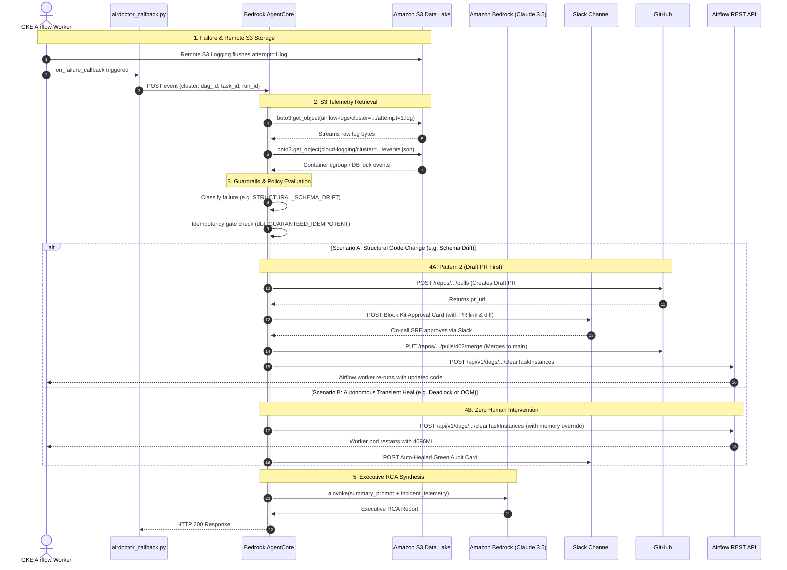
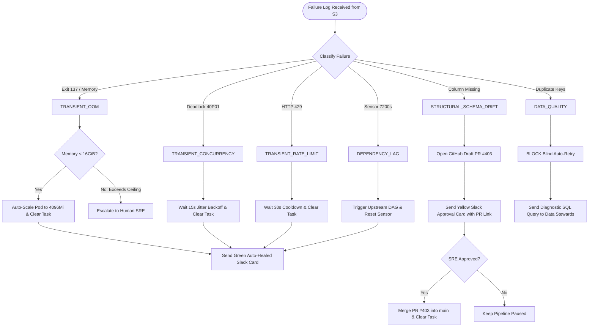

# 🌊 AirDoctor: Flow Architecture Specification

This document details the **Control Flow**, **Data Flow**, and **State Machine Transitions** across the AirDoctor autonomous SRE pipeline.

---

## 1. End-to-End System Flow (Mermaid)

```mermaid
flowchart TD
    subgraph GKE["☸️ Google Kubernetes Engine (GKE) Airflow"]
        Crash["💥 Task Crashes on Worker Pod<br/>(OOM, Deadlock, Schema Drift, etc.)"]
        Plugin["🔌 AirDoctor Plugin<br/>(on_failure_callback)"]
        Crash -->|Triggers callback| Plugin
    end

    subgraph S3["🪣 Amazon S3 Data Lake (s3://airdoctor-data-platform-logs-prod/)"]
        direction TB
        S3Logs["📁 airflow-logs/<br/>Task tracebacks & outputs"]
        S3Cloud["📁 cloud-logging/<br/>Kernel cgroup & DB locks"]
        S3Dbt["📁 dbt-artifacts/<br/>manifest.json & SQL models"]
    end

    Crash -.->|Remote logging sync| S3Logs

    subgraph AgentCore["☁️ AWS AgentCore & LangGraph Cognitive Runtime"]
        direction TB
        Node1["1️⃣ parse_alert<br/>Extract cluster, dag, task, run ID"]
        Node2["2️⃣ investigate_telemetry<br/>Stream S3 logs & correlate signals"]
        Node3["3️⃣ guardrails_evaluation<br/>Classify failure & verify idempotency"]
        
        Router{"🔀 Decision Router<br/>(Conditional Edge)"}
        
        Node4["4️⃣ slack_approval<br/>Dispatch Block Kit card & await sign-off"]
        Node5["5️⃣ execute_remediation<br/>Scale pod, clear task, or open PR"]
        Node6["6️⃣ generate_sre_report<br/>Bedrock (Claude 3.5) RCA summary"]

        Node1 --> Node2
        Node2 --> Node3
        Node3 --> Router
        
        Router -->|High Risk / PR / Ceiling Breach| Node4
        Router -->|Safe / Idempotent Auto-Heal| Node5
        
        Node4 --> Node5
        Node5 --> Node6
    end

    Plugin ==>|HTTP POST Event<br/>(Cluster, DAG, Task)| Node1
    Node2 <==|boto3 stream byte range| S3
    Node6 <==|Prompt & Context| Bedrock["🔮 Amazon Bedrock<br/>(Claude 3.5 Sonnet)"]

    subgraph Targets["⚡ Remediation Targets & SRE Output"]
        AirflowAPI["☸️ Airflow REST API<br/>Clear Task & Patch Pod Spec"]
        GitHub["🐙 GitHub Enterprise<br/>Open & Merge Pull Request"]
        Slack["💬 Slack Channel<br/>Approval Cards & Auto-Heal Audits"]
    end

    Node4 ==>|Interactive Card| Slack
    Node5 ==>|POST /api/v1/dags/.../clear| AirflowAPI
    Node5 ==>|POST /repos/.../pulls| GitHub
    Node6 ==>|Audit Confirmation| Slack
```

---

## 2. LangGraph State Machine & Data Transformations

Every incident flows through the **`AirDoctorState`** typed state machine. Below is the exact data transformation at each node:

| Step / Node | Input State Available | Operations Performed | Output State Produced |
| :--- | :--- | :--- | :--- |
| **`START`** | Raw prompt from webhook | Initialization | `messages: [HumanMessage]` |
| **`parse_alert`** | `messages` | Regex parsing of alert payload coordinates | `cluster`, `dag_id`, `task_id`, `run_id`, `operator` |
| **`investigate_telemetry`** | Coordinates | • Resolves S3 remote log URI<br>• Streams tail 50 lines via `boto3`<br>• Reads Cloud Logging S3 sink<br>• Resolves Git repo from catalog | `s3_log_uri`, `log_trace`, `cloud_logging_event`, `git_repo_url` |
| **`guardrails_evaluation`** | `log_trace`, `operator` | • Classifies failure category<br>• Verifies query idempotency (`MERGE`/`dbt`)<br>• Evaluates policy limits (16GiB ceiling)<br>• If schema drift: opens Draft PR | `failure_category`, `idempotency_level`, `can_auto_remediate`, `remediation_action`, `requires_human_approval`, `pr_url`, `git_diff` |
| **`route_after_guardrails`** | `requires_human_approval` | Evaluates conditional edge | Routes to `slack_approval` OR `execute_remediation` |
| **`slack_approval`** | `pr_url`, `git_diff`, `root_cause` | Dispatches Slack Block Kit card; records verified on-call approval token | `approval_status: "APPROVED"`, `remediation_details` |
| **`execute_remediation`** | `remediation_action` | • Calls Airflow REST API to clear task<br>• If PR: merges PR #403 into `main` | `remediation_details: "SUCCESS"` |
| **`generate_sre_report`** | Full incident state | Calls Amazon Bedrock (Claude 3.5 Sonnet) to write executive RCA report | `final_report: str`, `messages: [AIMessage]` |
| **`END`** | `final_report` | Serializes JSON response to AgentCore caller | HTTP 200 `{ "result": final_report }` |

---

## 3. Telemetry & Control Flow Sequence Diagram



---

## 4. Decision Tree Flowchart (Guardrails Engine)


