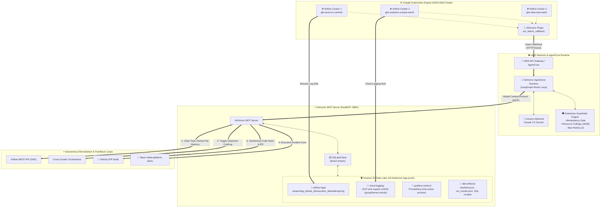

# 🩺 AirDoctor: Autonomous Airflow Self-Healing Pipelines

AirDoctor is an autonomous SRE and Data Platform agent built with **AWS AgentCore & Amazon Bedrock (Claude 3.5 Sonnet)**. It listens for failure callbacks from enterprise Airflow clusters running on **Google Kubernetes Engine (GKE)**, correlates signals across **Cloud Logging** and **Grafana**, diagnoses failures in **dbt** and custom SQL pipelines, and automatically executes self-healing remediations.

---

## 🎯 13 Ready-to-Demo Production Incident Scenarios

| Scenario | Incident Signature | Root Cause & Diagnostics | Self-Healing Remediation |
| :--- | :--- | :--- | :--- |
| **`oom`** | `KubernetesPodOperator` crash (Exit 137) | Container exceeded 2048Mi memory limit during massive multi-way join. Cloud Logging reveals cgroup OOM-killer. | **Auto-Heals:** AirDoctor patches pod spec override to `limits.memory: 4096Mi` and clears task instance to retry. |
| **`deadlock`** | PostgreSQL `40P01` Deadlock Detected | Concurrent batch sync clash on `merchant_balance_ledger`. Grafana metrics show lock contention cleared. | **Auto-Healed:** AirDoctor verifies transient nature, waits a 15s jitter backoff, and clears task instance. |
| **`schema_drift`**| `dbt run` failed in `fct_customer_churn_daily` | Upstream PR refactored `customer_account_id` to `account_id` in `stg_customers`. | **Draft PR & Merge:** Opens Draft PR #403 first, sends Slack card with link, and merges upon approval. |
| **`cross_cluster`**| Custom partition sensor timed out after 2h | US cluster waiting on partition `gs://eu-lake-events/dt=2026-09-29/`. Cloud Logging reveals EU DAG failed on expired token. | **Cross-Cluster Healed:** AirDoctor triggers upstream rerun on EU cluster and resets downstream sensor. |
| **`rate_limit`** | Stripe API HTTP `429 Too Many Requests` | External SaaS throttle on invoice pagination. Telemetry shows `Retry-After: 30` header. | **Smart Backoff:** AirDoctor applies 30s jitter cooldown and reschedules task retry. |
| **`data_quality`**| `dbt test` uniqueness constraint failed | 42 duplicate primary keys detected in `fct_omnichannel_attribution`. | **Compute Guard:** Blind retry blocked to avoid burning warehouse compute; alert sent to data stewards with root-cause SQL query. |
| **`spot_eviction`**| GKE Spot VM Preemption (Exit Code 143) | GKE drained spot node mid-run (`TerminatedByPreemption`). | **Reschedule On-Demand:** AirDoctor detects preemption, injects node-affinity to On-Demand pool, and resets task. |
| **`disk_full`** | Ephemeral Disk Full (OSError: [Errno 28]) | Worker DuckDB export exceeded GKE 20Gi scratch disk limit. | **Scratch Bump:** Dynamically scales ephemeral-storage to 50Gi and clears task. |
| **`statement_timeout`**| Analytical Query Timeout (> 3600s) | Complex cohort window calculation exceeded warehouse 1-hour cutoff. | **Dynamic Timeout:** Injects `SET statement_timeout = '2h'` session parameter and retries. |
| **`connection_pool`**| Postgres Connection Exhausted (max_connections=200) | 64 concurrent Airflow worker tasks saturated database slots. | **Concurrency Throttle:** Throttles DAG active tasks from 64 to 8 to release connections and queues retry. |
| **`zero_rows`** | Silent Data Anomaly (0 Rows Delivered vs 420K Baseline) | Partner API delivery delivered empty array `[]` without erroring. | **Dashboard Guard:** Pauses downstream reporting DAGs to prevent corrupting executive dashboards; alerts on-call. |
| **`division_by_zero`**| Custom SQL Division by Zero in Fee Calculation | `net_payout / gross_transactions` crashed when transactions were 0. | **SQL NULLIF Patch:** Synthesizes `NULLIF(gross_transactions, 0)` guard, opens PR #112, and merges upon Slack sign-off. |
| **`clock_skew`** | AWS S3 RequestTimeTooSkewed (NTP Drift) | GKE node VM clock drifted by >15 minutes, failing SigV4 authentication. | **NTP Route:** AirDoctor reschedules pod on a time-synchronized node pool and clears task. |

---

## 🚀 How to Run the Demo on Stage

### 1. Interactive Demo Runner (Deterministic / Offline-Safe)
Run the stage-ready CLI simulator that executes the full 4-step diagnostic and remediation workflow:

```bash
# Run GKE OOM scenario
python demo_runner.py --scenario oom

# Run transient PostgreSQL deadlock scenario
python demo_runner.py --scenario deadlock

# Run dbt schema drift scenario
python demo_runner.py --scenario schema_drift

# Run cross-cluster upstream dependency scenario
python demo_runner.py --scenario cross_cluster

# List all available scenarios
python demo_runner.py --list
```

### 2. Live AgentCore & MCP Mode (Bedrock Live Invocation)
To run the full LangGraph agent connected to Amazon Bedrock and the MCP server:

1. **Start the AirDoctor MCP Server (Terminal 1):**
   ```bash
   python mcp_server/mock_server.py
   ```
   *Runs on `http://0.0.0.0:8081` with Streamable HTTP transport.*

2. **Run the Live Agent (Terminal 2):**
   ```bash
   python demo_runner.py --scenario oom --mode live
   ```

### 3. Multi-Cloud LLM Provider Setup (Bedrock & Vertex AI)

AirDoctor supports both **Amazon Bedrock** and **Google Cloud Vertex AI** via the `LLM_PROVIDER` environment variable:

#### Option A: Amazon Bedrock (Default)
```bash
export LLM_PROVIDER="bedrock"
export AWS_REGION="us-east-1"
export BEDROCK_MODEL_ID="global.anthropic.claude-sonnet-4-5-20250929-v1:0"
```

#### Option B: Google Cloud Vertex AI (Gemini 3 Pro / Claude on Vertex)
```bash
pip install langchain-google-vertexai
export LLM_PROVIDER="vertexai"
export GOOGLE_CLOUD_PROJECT="my-gcp-project"
export GOOGLE_CLOUD_REGION="us-central1"
export VERTEX_MODEL_NAME="gemini-3-pro"
```

---

## 🏛️ System Architecture

### 1. High-Level Topology (Mermaid)



### 2. Detailed Component Architecture (ASCII)

```
┌────────────────────────────────────────────────────────────────────────────────────────────────────────┐
│                                  MULTI-CLUSTER GKE AIRFLOW CLUSTERS                                    │
│                                                                                                        │
│   ┌──────────────────────────────┐  ┌──────────────────────────────┐  ┌────────────────────────────┐   │
│   │   [gke-prod-us-central1]     │  │[gke-analytics-europe-west1]  │  │   [gke-data-asia-east1]    │   │
│   │   • analytics_daily_etl      │  │• finance_daily_marts         │  │   • apac_orders_rollup     │   │
│   │   • financial_ledger_sync    │  │• eu_raw_ingestion_hourly     │  │   • wechat_alipay_settle   │   │
│   │   • stripe_reconciliation    │  │• inventory_optimizer         │  │                            │   │
│   └──────────────┬───────────────┘  └──────────────┬───────────────┘  └─────────────┬──────────────┘   │
│                  │                                 │                                │                  │
│                  └─────────────────────────────────┼────────────────────────────────┘                  │
│                                                    │ on_failure_callback                               │
│                                                    ▼                                                   │
│                                 ┌────────────────────────────────────┐                                 │
│                                 │   airdoctor_callback.py (Plugin)   │                                 │
│                                 │  • Non-blocking background thread  │                                 │
│                                 │  • Captures cluster/pod/exception  │                                 │
│                                 └──────────────────┬─────────────────┘                                 │
└────────────────────────────────────────────────────┼───────────────────────────────────────────────────┘
                                                     │ HTTP POST Event
                                                     ▼
┌────────────────────────────────────────────────────────────────────────────────────────────────────────┐
│                                    AWS AGENTCORE & BEDROCK COGNITIVE RUNTIME                           │
│                                                                                                        │
│  ┌──────────────────────────────────────────────────┐         ┌─────────────────────────────────────┐  │
│  │           Amazon Bedrock (Claude 3.5 Sonnet)     │◄───────►│    LangGraph ReAct Cognitive Loop   │  │
│  │           • SRE Data Platform Persona            │         │    • Plan ➔ Act ➔ Observe           │  │
│  │           • Multi-Cluster Root Cause Diagnosis   │         │    • MemorySaver state tracking     │  │
│  └──────────────────────────────────────────────────┘         └──────────────────┬──────────────────┘  │
│                                                                                  │                     │
│  ┌───────────────────────────────────────────────────────────────────────────────┴──────────────────┐  │
│  │                            🛡️ ENTERPRISE SAFETY & IDEMPOTENCY GUARDRAILS                         │  │
│  │  • Failure Classifier (OOM vs Deadlock vs Schema Drift vs Rate Limit vs Data Quality)            │  │
│  │  • Idempotency Gate (Block retries on raw INSERT INTO; authorize for dbt / MERGE / OVERWRITE)   │  │
│  │  • Policy Limits (Max Memory Ceiling: 16GiB | Max Auto-Retries: 2 | Jitter Backoff: 10s-30s)    │  │
│  └───────────────────────────────────────────────┬──────────────────────────────────────────────────┘  │
└──────────────────────────────────────────────────┼─────────────────────────────────────────────────────┘
                                                   │ MCP Protocol (Streamable HTTP :8081)
                                                   ▼
┌────────────────────────────────────────────────────────────────────────────────────────────────────────┐
│                                       AIRDOCTOR MCP SERVER (:8081)                                     │
│                                                                                                        │
│   ┌───────────────────────────┐  ┌───────────────────────────┐  ┌──────────────────────────────────┐   │
│   │   Airflow REST API Tools  │  │   S3 Data Lake Tools      │  │   Self-Healing Remediation Tools │   │
│   │   • get_task_details      │  │   • s3_fetch_airflow_log  │  │   • BUMP_POD_MEMORY_AND_CLEAR    │   │
│   │   • list_dag_runs         │  │   • s3_query_cloud_logs   │  │   • CLEAR_TASK_INSTANCE          │   │
│   │   • clear_task_instance   │  │   • s3_query_grafana      │  │   • TRIGGER_UPSTREAM_DAG         │   │
│   │   • patch_pod_spec        │  │   • s3_get_dbt_artifact   │  │   • CREATE_GITHUB_PR             │   │
│   └─────────────┬─────────────┘  └─────────────┬─────────────┘  └─────────────────┬────────────────┘   │
└─────────────────┼──────────────────────────────┼──────────────────────────────────┼────────────────────┘
                  │                              │                                  │
                  ▼                              ▼                                  ▼
┌───────────────────────────────────┐ ┌────────────────────────────────────┐ ┌───────────────────────────┐
│         AIRFLOW REST API          │ │     AMAZON S3 DATA LAKE            │ │   REMEDIATION TARGETS     │
│   • Clear Task State              │ │  s3://airdoctor-logs-prod/         │ │  • Dynamic Pod Spec Bump  │
│   • Trigger Upstream DAG          │ │   ├── airflow-logs/ (41+ files)    │ │  • GitHub PR Synthesis    │
│   • Reset Partition Sensor        │ │   ├── cloud-logging/ (S3 sink)     │ │  • Slack Incident Card    │
│   • Update Pod Resource Limits    │ │   ├── grafana-metrics/ (Prometheus)│ │  • Data Steward Escalation│
│                                   │ │   └── dbt-artifacts/ (Manifests)   │ │                           │
└───────────────────────────────────┘ └────────────────────────────────────┘ └───────────────────────────┘
```

---

## 🪣 Enterprise Amazon S3 Data Lake Architecture

In real enterprise deployments, Airflow logs, GCP Cloud Logging exports, and dbt artifacts are archived in **Amazon S3 Object Storage**. AirDoctor connects directly to this data lake:

```
s3://airdoctor-data-platform-logs-prod/
├── airflow-logs/                     # Apache Airflow S3 remote logging hierarchy
│   ├── cluster=gke-prod-us-central1/
│   │   ├── dag_id=analytics_daily_etl/.../attempt=1.log (OOM failure)
│   │   ├── dag_id=analytics_daily_etl/.../attempt=1.log (Yesterday baseline: SUCCESS)
│   │   ├── dag_id=financial_ledger_sync/.../attempt=1.log (Deadlock)
│   │   ├── dag_id=customer_360_identity_graph/... (Spark on GKE: SUCCESS)
│   │   └── dag_id=realtime_fraud_feature_store/... (Delta lake: SUCCESS)
│   └── cluster=gke-analytics-europe-west1/
│       ├── dag_id=finance_daily_marts/... (dbt schema drift)
│       └── dag_id=eu_raw_ingestion_hourly/... (Token expired)
├── cloud-logging/                    # GCP Cloud Logging S3 sink exports (JSON)
│   ├── cluster=gke-prod-us-central1/year=2026/month=09/day=29/...
│   └── cluster=gke-analytics-europe-west1/...
├── grafana-metrics/                  # Prometheus metric timeseries archives
│   └── cluster=gke-prod-us-central1/metric=container_memory_working_set/...
├── dbt-artifacts/                    # Compiled manifests & run_results.json
│   └── project=finance/run_id=scheduled__2026-09-29T11:00:00/
└── git-repos/                        # Analytics repository mirror
    └── analytics-dbt/models/...

```

### Syncing to Real AWS S3
To push the simulated data lake directly to a live Amazon S3 bucket for the Bedrock agent:
```bash
python sync_to_s3.py --bucket <your-aws-s3-bucket-name> [--region us-east-1]
export AIRDOCTOR_S3_BUCKET=<your-aws-s3-bucket-name>
```
If `AIRDOCTOR_S3_BUCKET` is not set or you are running offline, AirDoctor transparently uses the local S3 lake mirror in `s3_data_lake/` with zero configuration changes!

---

## 🛡️ Enterprise-Grade Production Capabilities

### 1. Dynamic Git Repository Discovery Engine (`core/repo_resolver.py`)
**How does AirDoctor know which repository to target for fix PRs?**
In an enterprise multi-cluster platform with dozens of teams, AirDoctor uses a **4-tier discovery hierarchy**:
1. **GKE Pod Annotations (`GIT_SYNC_REPO`):** Inspects the KubernetesPodOperator environment variables injected by the Airflow GKE git-sync sidecar.
2. **dbt S3 Manifest Lineage (`manifest.json`):** Reads the compiled dbt model graph from the S3 Data Lake, extracting `original_file_path` (e.g. `models/marts/finance/fct_customer_churn_daily.sql`) and target project mapping.
3. **Airflow DAG Tags (`repo:*`):** Inspects DAG metadata tags (e.g. `repo:analytics-dbt`).
4. **Enterprise Service Catalog (`config/repo_catalog.json`):** Declarative enterprise mapping between DAG IDs, code subpaths, code owners (`@analytics-engineering`), and Slack alert channels (`#team-analytics-eng`).

### 2. Human-in-the-Loop (HITL) Slack Interactive Approval (`core/slack_approval.py`)
AirDoctor never blindly merges code or scales expensive infrastructure without oversight:
- Dispatches a **Slack Block Kit** interactive notification with action buttons:
  `[ ✅ Approve & Execute ]`   `[ ❌ Reject ]`   `[ 💬 Modify Parameters ]`
- Attaches the unified git diff and impact analysis directly to the channel owned by that repository's team.
- Once approved by the on-call engineer, AirDoctor verifies the cryptographically signed authorization token before dispatching the GitHub PR or Airflow API clear command.

### 3. Safety & Idempotency Guardrails Engine (`core/guardrails.py`)
Data engineering teams disable auto-retry because blindly retrying broken SQL wastes warehouse compute, while retrying non-idempotent scripts corrupts financial data.
AirDoctor enforces:
- **Idempotency Verification:** Checks if queries use `INSERT OVERWRITE`, `MERGE`, or dbt models before authorizing any auto-clear.
- **Resource Ceilings:** Prevents memory limit bumps beyond 16GiB without explicit human review.
- **Retry Caps:** Enforces a hard limit of 2 auto-retries per task instance.

### 4. Multi-Framework Autonomous Code & SQL Patcher (`core/patcher.py`)
AirDoctor does not just fix dbt models—it patches across all 3 layers of your data stack:
1. **dbt Models:** Parses compilation failures and repairs upstream schema drift (column renames).
2. **Custom SQL Framework:** Detects runtime exceptions such as division-by-zero and automatically wraps denominators with `NULLIF(denominator, 0)` so queries safely return `NULL` instead of aborting transactions.
3. **Airflow DAG Python Files (Infrastructure-as-Code):** When a Kubernetes pod OOMs, AirDoctor not only dynamically clears the task in Airflow—it opens a Git PR against the Python DAG definition (`dags/analytics_daily_etl.py`) scaling `resources.limits.memory: 4096Mi` permanently in Git!

### 5. Drop-in Airflow Plugin (`airflow_plugin/airdoctor_callback.py`)
Any team can adopt AirDoctor in minutes:
```python
# In your airflow dags/ or plugins/
from airflow_plugin.airdoctor_callback import airdoctor_failure_callback

default_args = {
    'on_failure_callback': airdoctor_failure_callback,
    ...
}
```
It extracts cluster name, pod identity, execution dates, and exception traces, and dispatches an asynchronous, non-blocking HTTP payload to AWS AgentCore without impacting Airflow scheduler stability.
